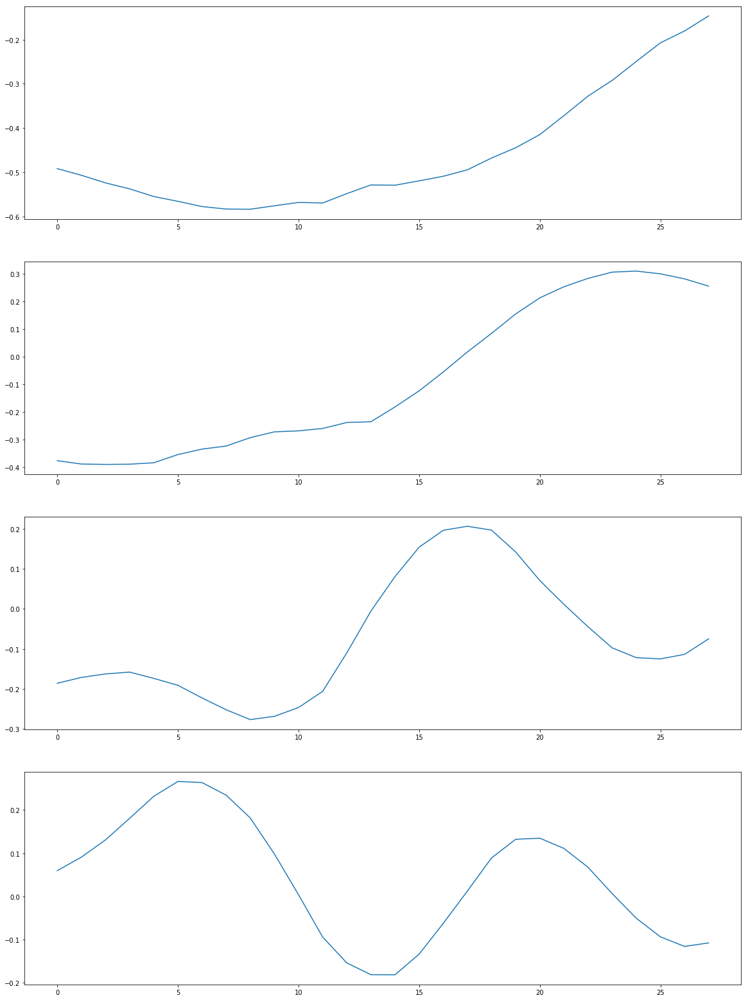
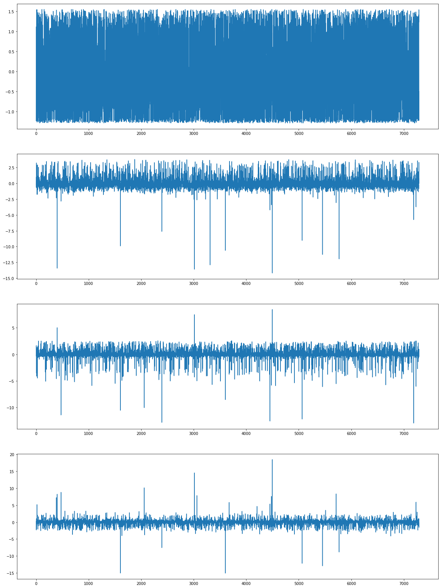

# Preparing data for model training

Firstly, ensure that the appropriate tools are installed


```python
!conda install -y mysql-connector-python
!conda install -y scikit-learn
```

then some basic code definitions:


```python
import io
import json
import boto3
import base64
import s3fs
import random
import datetime
import numpy as np
import pandas as pd
import matplotlib.pyplot as plt
import mysql.connector
from botocore.exceptions import ClientError

def get_db_connection():
    session = boto3.session.Session()
    client = session.client(service_name='secretsmanager', region_name='us-east-1')
    try:
        response = client.get_secret_value(SecretId='prod-rds-read-write')
    except ClientError as e:
        if e.response['Error']['Code'] == 'ResourceNotFoundException':
            print("The requested secret {} was not found".format(secret_name))
        elif e.response['Error']['Code'] == 'InvalidRequestException':
            print("The request was invalid due to {}".format(e))
        elif e.response['Error']['Code'] == 'InvalidParameterException':
            print("The request had invalid params: {}".format(e))
    else:
        if 'SecretString' in response:
            secret = json.loads(response['SecretString'])
        else:
            secret = base64.b64decode(response['SecretBinary'])
    connection = mysql.connector.connect(user=secret['username'], password=secret['password'], host=secret['host'])
    return connection

def data_split(FILE_DATA, FILE_TRAIN, FILE_VALIDATION, FILE_TEST, PERCENT_TRAIN, PERCENT_VALIDATION, PERCENT_TEST):
    data = [l for l in open(FILE_DATA, 'r')]
    train_file = open(FILE_TRAIN, 'w')
    valid_file = open(FILE_VALIDATION, 'w')
    tests_file = open(FILE_TEST, 'w')

    num_of_data = len(data)
    num_train = int((PERCENT_TRAIN/100.0)*num_of_data)
    num_valid = int((PERCENT_VALIDATION/100.0)*num_of_data)
    num_tests = int((PERCENT_TEST/100.0)*num_of_data)

    data_fractions = [num_train, num_valid, num_tests]
    split_data = [[],[],[]]

    rand_data_ind = 0

    for split_ind, fraction in enumerate(data_fractions):
        for i in range(fraction):
            rand_data_ind = random.randint(0, len(data)-1)
            split_data[split_ind].append(data[rand_data_ind])
            data.pop(rand_data_ind)

    for l in split_data[0]:
        train_file.write(l)

    for l in split_data[1]:
        valid_file.write(l)

    for l in split_data[2]:
        tests_file.write(l)

    train_file.close()
    valid_file.close()
    tests_file.close()

def write_to_s3(fobj, bucket, key):
    return boto3.Session().resource('s3').Bucket(bucket).Object(key).upload_fileobj(fobj)

def upload_to_s3(bucket, channel, filename):
    fobj=open(filename, 'rb')
    key = prefix+'/'+channel
    url = 's3://{}/{}/{}'.format(bucket, key, filename)
    print('Writing to {}'.format(url))
    write_to_s3(fobj, bucket, key)

def get_asset_data(conn, asset_id, from_date, to_date):
    return pd.read_sql("SELECT pr.date, DAYOFYEAR(pr.date) as doy, pr.prt1, pr.prt7, pr.prt365, prb.prt7 as lag_prt7, prb.prt365 as lag_prt365, ad.energy " + 
        "FROM performance_ratio pr " +
        "LEFT JOIN actual_daily ad ON pr.asset_id = ad.asset_id AND pr.date = ad.date " +
        "LEFT JOIN performance_ratio prb ON pr.asset_id = prb.asset_id AND pr.date = DATE_ADD(prb.date, INTERVAL 1 YEAR) " +
        "WHERE pr.date >= '{0}' AND pr.date <= '{1}' ".format(from_date.isoformat(), to_date.isoformat()) +
        "AND pr.asset_id = {0} ".format(asset_id) +
        "ORDER BY pr.date DESC", 
        con=conn, parse_dates=['date']).set_index(['date'])

def create_libsvm_row(label, values):
    row = [label]
    row.extend(["{0}:{1:0.5}".format(index, item) for (index, item) in zip(range(len(values)), values) if not np.isnan(item)])
    return ' '.join(row)


```

## Generating "normal" data


```python
sample_length = 28
num_samples_per_asset = 14   # approx 684 "non-anomalous" exemplars
sample_limit = 800

def create_sample(data):
    first_element = data.iloc[0].fillna(-1.0)
    values = [float(first_element.doy), float(first_element.prt365), float(first_element.lag_prt365)]
    values.extend(data.prt1.fillna(-1.0).tolist())
    return values
```

We select those assets with no identified anomalous events, and from their data histories take random 28-day samples. Each day of each sample includes just the performance ratio computed for that day. The sample is appended to the day-of-year, initial PRT365, and one-year-lagged PRT365 of the start of the sequence to form a single 30-dimensional vector, which is then written as a training record with the label "0" (for "normal"), weighted at 0.9. Missing values are set to -1.0 before processing.


```python
try:
    conn = get_db_connection()
    conn.database = 'omnidian'

    with open("101anomalies.json") as inp, open("sample.libsvm", 'w') as outp:
        num_samples = 0
        asset_ids = [next(iter(json.loads(line).keys())) for line in iter(inp.readline, '') if line[-4:-1] == "[]}"]
        random.shuffle(asset_ids)
        for asset_id in asset_ids:
            to_date = datetime.date(2016, 1, 1) + datetime.timedelta(days=(random.randrange(sample_length, 2*365-sample_length-num_samples_per_asset)+num_samples_per_asset))
            from_date = to_date - datetime.timedelta(days=sample_length+num_samples_per_asset)
            asset_data = get_asset_data(conn, asset_id, from_date, to_date)
            # check that the data actually exists
            if asset_data.shape[0] == (to_date-from_date).days+1:
                print(asset_id, end=' ')
                for offset in range(num_samples_per_asset):
                    sample = asset_data.iloc[offset:offset+sample_length]
                    if not np.all(np.isnan(sample.prt1.fillna(np.nan))) and num_samples < sample_limit:
                        row = create_libsvm_row("0:0.9", create_sample(sample))
                        outp.write(row + '\n')
                        num_samples += 1

finally:
    conn.close()

```

    101111695 101112939 101111899 101112666 101111537 101113016 101113073 101113146 101113303 101111610 101112720 101112607 101112866 101113446 101112635 101111877 101111958 101112984 101113352 101112608 101113383 101111578 101112940 101112809 101111707 101112653 101111814 101112458 101112811 101112761 101111904 101112019 101113033 101113047 101113180 101112375 101111784 101112748 101112696 101111863 101113195 101112751 101113188 101112960 101112094 101112652 101113289 101111478 101112941 101113049 101113452 101113455 101112297 101112675 101113215 101111936 101112095 101112129 101111780 101113236 101112364 101111467 101112803 101111860 101112694 101113030 101112911 101112756 101113391 101113248 101111951 101111615 101113021 101111592 101112395 101112324 101113462 101112832 101111722 101112842 101111779 101111963 101113042 101113182 101112398 101112239 101111763 101113262 101112338 101112199 101111987 101111750 101113378 101111594 101112466 101112260 101113157 101112354 101112172 101112161 101111982 101113260 101111603 101112539 101113091 101111545 101112902 101111691 101112634 101112472 101111960 101111842 101112385 101111462 101112733 101111705 101113275 101113202 101113406 101111905 101112253 101111837 101113450 101112611 101112271 101112730 101111668 101113354 101111521 101111508 101111977 101112617 101112110 101112563 101112826 101111878 101112919 101111572 101113238 101111655 101111721 101112996 101112215 101113174 101111527 101112736 101111833 101112138 101112872 101113095 101112178 101113370 101112014 101111557 101112187 101112698 101112249 101112501 101111565 101111675 101112033 101111506 101111829 101112645 101112078 101112591 101112432 101112268 101112552 101113204 101111662 101112565 101113330 101113197 101113362 101112119 101112515 101113102 101111883 101112218 101111507 101112392 101112670 101113167 101111589 101112650 101113045 101112995 101113069 101112869 101111493 101112871 101112974 101112066 101112777 101111591 101112867 101111992 101112179 101113377 101112927 101111595 101112329 101111682 101111581 101111461 101111931 101111555 101113412 101111554 101113061 101112840 101111488 101112366 101112072 101112727 101112487 101111499 101112101 101112013 101112745 101111542 101111787 101112000 101112489 101113135 101113051 101111543 101112264 101112345 101113392 101111821 101112901 101113439 101112453 101112629 101112860 101112221 101111582 101111496 101112311 101112054 101112171 101112731 101112600 101113400 101112936 101112038 101112788 101111947 101112157 101113144 101112758 101113038 101112667 101111700 101112424 101111549 101111822 101112441 101113201 101111539 101112955 101113118 101112861 101111773 101113164 101113298 101111585 101113194 101112155 101112880 101113175 101111623 101111501 101112546 101112881 101111609 101113104 101112204 101112087 101113186 101111712 101113417 101111855 101112269 101112884 101111978 101111930 101111584 101112823 101113304 101111710 101111897 101113170 101113423 101113415 101112113 101112359 101112102 101112368 101112488 101111817 101112545 101111911 101111975 101112688 101111739 101111887 101113220 101112391 101112508 101112355 101112023 101113401 101112918 101112294 101112948 101112806 101112822 101112238 101113131 101113272 101113053 101112841 101111765 101112637 101112855 101113470 101112497 101111643 101112426 101113072 101111504 101111699 101112536 101112108 101112785 101112597 101111830 101112291 101112672 101112701 101113239 101111948 101111998 101112605 101112485 101112837 101111661 101111795 101112295 101111985 101113137 101113178 101111514 101112414 101111635 101112045 101112850 101112721 101113054 101111907 101112132 101112771 101111606 101112655 101112896 101113092 101111725 101111671 101112540 101111560 101113270 101112082 101112040 101112762 101112719 101112928 101112612 101112380 101112142 101111608 101111744 101113388 101112163 101112678 101112776 101112361 101111890 101111819 101111898 101113309 101111664 101112140 101113223 101112862 101112255 101111613 101112211 101111513 101113011 101111844 101111471 101112541 101112447 101112520 101111753 101112423 101111922 101111561 101113457 101112553 101112663 101112135 101111724 101111920 101112208 101111858 101113002 101111570 101111538 101113103 101112152 101112105 101112367 101111455 101112310 101111918 101113433 101111522 101112507 101111782 101112533 101112933 101112593 101112226 101113255 101112586 101112562 101111873 101112690 101111698 101111679 101112514 101113294 101111638 101112506 101111879 101112895 101111680 101113070 101111847 101112233 101112544 101112459 101111516 101113209 101111896 101111789 101113264 101112924 101111875 101111629 101112985 101111881 101112443 101111631 101112257 101112845 101113152 101111805 101113187 101111848 101113244 101111902 101113059 101112903 101111968 101113063 101111734 101113441 101111598 101111826 101111903 101112573 101112402 101113228 101112390 101113229 101112290 101112759 101111872 101112704 101112781 101112651 101112468 101112876 101112134 101112739 101112909 101113331 101113124 101111484 101112795 101111634 101113062 101111728 101112577 101113094 101112549 101111755 101112222 101113453 101112444 101112966 101112559 101112816 101112358 101113210 101111761 101113384 101111530 101113203 101112768 101113420 101113160 101113218 101111475 101112656 101111764 101113431 101113253 101112272 101112091 101112036 101112524 101113395 101112807 101112451 101111859 101111943 101112103 101111599 101112056 101111526 101111823 101112323 101111747 101111925 101112122 101112346 101112817 101112455 101112027 101112938 101112753 101111520 101112654 101111919 101112130 101112702 101112309 101113067 101112292 101112080 101111870 101111709 101112738 101112016 101113359 101113089 101113017 101111509 101111548 101113205 101112037 101112121 101111518 101112959 101113346 101113037 101112174 101112376 101112188 101111831 101112241 101111577 101111690 101112615 101112007 101111535 101112910 101112217 101113006 101113123 101112525 101112668 101112561 101111809 101113308 101113373 101111459 101111745 101111460 101111541 101112282 101112484 101112660 101113459 101112267 101112285 101113266 101113360 101111832 101112723 101113207 101113105 101112425 101112258 101113429 101112164 101112341 101112921 101112413 101112904 101111730 101112173 101113413 101113156 101112575 101112193 101111729 101112060 101111914 101111588 101112337 101112469 101111942 101111981 101111889 101112353 101112659 101112118 101111828 101112378 101112630 101113314 101113165 101112047 101112752 101111558 101111511 101111928 101113334 101111602 101112699 101112997 101112196 101111811 101112473 101111777 101111793 101112048 101112641 101113127 101112681 101112491 101112828 101111970 101112308 101112875 101112587 101112743 101111917 101112993 101112774 101112900 101111909 101111466 101112197 101112177 101113039 101111452 101111803 101113136 101113396 101111567 101111813 101112716 101113132 101112427 101113375 101111683 101112065 101113372 101113024 101112203 101112460 101111568 101112327 101111450 101111838 101113257 101111790 101112800 101113427 101113058 101112120 101111703 101111468 101112410 101111751 101112431 101111894 101111921 101112673 101112326 101111579 101111566 101112946 101112107 101111885 101112114 101112523 101112182 101112070 101112969 101112003 101111938 101112074 101112328 101111449 101113086 101112819 101112829 101111798 101113311 101113044 101111620 101112067 101111924 101111852 101112035 101112594 101111639 101113196 101112932 101112254 101112158 101113048 101112691 101111534 101112165 101113185 101111957 101113111 101111910 101113041 101111562 101111451 101112079 101112153 101111649 101113183 101112717 101112521 101112097 101113108 101111656 101112883 101112032 101111523 101111447 101112313 101112534 101112818 101111505 101112898 101112404 101112977 101112351 101112348 101111807 101111694 101111448 101112030 101113162 101112596 101112999 101111480 101112864 101112851 101112972 101111864 101112051 101112926 101112277 101112026 101112262 101113222 101112412 101113351 101112022 101112665 101111794 101112825 101113435 101112991 101111723 101112894 101112874 101112899 101113432 101111463 101111465 101112517 101111697 101111497 101113081 101113283 101112848 

## Generating labeled data

We next read the output of the labeling job. For each day of each labeled event, we generate a 28-day sample leading up to that day, and output that sample as a vector labeled with the label provided by the human labelers.


```python
try:
    conn = get_db_connection()
    conn.database = 'omnidian'

    with open("final.manifest") as inp, open("labeled.libsvm", 'w') as outp:
        for line in iter(inp.readline, ''):
            data = json.loads(line)
            asset_id = data["asset_id"]
            print(asset_id, end=' ')
            (start, end) = [datetime.datetime.strptime(d, "%Y-%m-%d").date() for d in data["dates"]]
            # move the start date back the length of a sample
            start = start - datetime.timedelta(days=sample_length)
            label = data["SunPower-Labeling-Fixed"] + 1
            confidence = data["SunPower-Labeling-Fixed-metadata"]["confidence"]
            asset_data = get_asset_data(conn, asset_id, start, end)
            label_value = str(label) if label != 8 else "0"
            for index in range(min(num_samples_per_asset, len(asset_data) - sample_length)):
                sample = asset_data.iloc[index:index+sample_length]
                row = create_libsvm_row(label_value + ":" + str(confidence), create_sample(sample))
                outp.write(row + '\n')

finally:
    conn.close()

```

    101111457 101111458 101111469 101111470 101111473 101111473 101111481 101111482 101111482 101111483 101111486 101111487 101111490 101111491 101111502 101111517 101111544 101111550 101111552 101111553 101111564 101111569 101111571 101111574 101111575 101111583 101111586 101111587 101111597 101111604 101111607 101111622 101111627 101111627 101111633 101111647 101111651 101111652 101111657 101111659 101111660 101111663 101111667 101111685 101111693 101111701 101111702 101111704 101111711 101111715 101111716 101111726 101111727 101111731 101111741 101111748 101111752 101111752 101111754 101111756 101111757 101111758 101111769 101111769 101111770 101111770 101111772 101111776 101111776 101111781 101111786 101111791 101111792 101111797 101111799 101111799 101111806 101111816 101111827 101111839 101111841 101111841 101111843 101111845 101111849 101111851 101111857 101111868 101111871 101111874 101111874 101111880 101111884 101111892 101111900 101111901 101111906 101111923 101111926 101111934 101111939 101111944 101111946 101111950 101111950 101111953 101111954 101111961 101111964 101111967 101111973 101111976 101111979 101111980 101111980 101111984 101111988 101111993 101111995 101111999 101112001 101112004 101112004 101112005 101112009 101112010 101112031 101112034 101112039 101112042 101112050 101112053 101112063 101112068 101112071 101112073 101112077 101112081 101112083 101112086 101112089 101112092 101112092 101112092 101112093 101112100 101112100 101112117 101112127 101112128 101112128 101112128 101112137 101112149 101112151 101112156 101112159 101112166 101112166 101112168 101112170 101112175 101112185 101112192 101112195 101112198 101112200 101112200 101112205 101112206 101112207 101112213 101112214 101112219 101112219 101112223 101112227 101112228 101112231 101112235 101112240 101112243 101112244 101112244 101112248 101112250 101112251 101112261 101112275 101112276 101112279 101112300 101112304 101112305 101112307 101112312 101112314 101112315 101112317 101112317 101112318 101112318 101112332 101112333 101112343 101112344 101112344 101112350 101112357 101112360 101112360 101112362 101112370 101112381 101112383 101112384 101112386 101112386 101112388 101112389 101112393 101112399 101112400 101112407 101112407 101112415 101112416 101112420 101112420 101112421 101112430 101112435 101112436 101112440 101112440 101112442 101112448 101112450 101112456 101112457 101112457 101112462 101112471 101112476 101112477 101112480 101112490 101112499 101112504 101112504 101112516 101112522 101112522 101112527 101112529 101112531 101112532 101112535 101112535 101112538 101112543 101112547 101112548 101112555 101112557 101112558 101112558 101112568 101112574 101112579 101112583 101112584 101112589 101112592 101112595 101112599 101112601 101112602 101112603 101112619 101112620 101112621 101112622 101112626 101112627 101112628 101112632 101112633 101112633 101112636 101112636 101112639 101112640 101112643 101112643 101112644 101112647 101112648 101112662 101112676 101112680 101112682 101112685 101112686 101112687 101112689 101112700 101112700 101112703 101112707 101112707 101112708 101112709 101112711 101112712 101112718 101112724 101112725 101112732 101112734 101112747 101112747 101112749 101112749 101112750 101112757 101112757 101112764 101112766 101112767 101112770 101112775 101112778 101112780 101112789 101112791 101112793 101112797 101112801 101112802 101112804 101112808 101112812 101112814 101112830 101112830 101112831 101112836 101112838 101112846 101112846 101112854 101112856 101112857 101112859 101112865 101112870 101112878 101112879 101112886 101112897 101112905 101112905 101112907 101112908 101112908 101112914 101112916 101112917 101112920 101112929 101112937 101112942 101112942 101112942 101112943 101112945 101112947 101112953 101112954 101112957 101112963 101112971 101112971 101112973 101112980 101112983 101112994 101112998 101113003 101113005 101113008 101113009 101113014 101113015 101113020 101113020 101113025 101113026 101113026 101113035 101113043 101113046 101113050 101113055 101113056 101113060 101113068 101113074 101113074 101113075 101113076 101113090 101113090 101113093 101113096 101113100 101113101 101113106 101113106 101113106 101113113 101113114 101113115 101113119 101113125 101113126 101113128 101113134 101113142 101113150 101113153 101113166 101113179 101113181 101113184 101113189 101113190 101113206 101113213 101113216 101113217 101113225 101113226 101113227 101113230 101113231 101113232 101113233 101113234 101113237 101113245 101113245 101113246 101113269 101113271 101113274 101113276 101113277 101113279 101113280 101113280 101113282 101113284 101113287 101113288 101113290 101113291 101113292 101113296 101113297 101113302 101113305 101113307 101113313 101113316 101113318 101113323 101113325 101113326 101113328 101113335 101113335 101113340 101113340 101113341 101113343 101113344 101113347 101113348 101113350 101113355 101113357 101113363 101113364 101113381 101113382 101113386 101113390 101113393 101113398 101113404 101113408 101113411 101113414 101113416 101113418 101113422 101113426 101113430 101113434 101113448 101113448 101113454 101113458 101113460 101113463 101113468 101113468 101113468 101113469 101199990 101199990 101111477 101111512 101111818 101111862 101111955 101112006 101112044 101112069 101112085 101112273 101112286 101112333 101112625 101112729 101112951 101112988 101112990 101113004 101113022 101113027 101113122 101113219 101113279 101113281 101113282 101113407 101113409 101113409 

Now we combine the data:


```python
! cat labeled.libsvm sample.libsvm | sort --random-sort >shuffled.libsvm 
# ! cat labeled.libsvm | sort --random-sort >shuffled.libsvm  
```

and split the data into three separate datasets for training


```python
bucket='omnidian-sagemaker-experiment' # put your s3 bucket name here, and create s3 bucket
prefix = 'data-f31-norm-full'

FILE_DATA = 'shuffled.libsvm'
#split the downloaded data into train/test/validation files
FILE_TRAIN = 'cat.train'
FILE_VALIDATION = 'cat.validation'
FILE_TEST = 'cat.test'
PERCENT_TRAIN = 75
PERCENT_VALIDATION = 25
PERCENT_TEST = 0
data_split(FILE_DATA, FILE_TRAIN, FILE_VALIDATION, FILE_TEST, PERCENT_TRAIN, PERCENT_VALIDATION, PERCENT_TEST)

#upload the files to the S3 bucket
upload_to_s3(bucket, 'train', FILE_TRAIN)
upload_to_s3(bucket, 'validation', FILE_VALIDATION)
#upload_to_s3(bucket, 'test', FILE_TEST)
```

    Writing to s3://omnidian-sagemaker-experiment/data-f31-norm-full/train/cat.train
    Writing to s3://omnidian-sagemaker-experiment/data-f31-norm-full/validation/cat.validation


### Principle Component Analysis

This is an experiment to extract "hidden signals" in the historical data


```python
try:
    conn = get_db_connection()
    all_data = pd.read_sql("SELECT pr.asset_id, pr.date, YEAR(pr.date) as year, DAYOFYEAR(pr.date) as doy, pr.prt1, pr.prt7, ad.energy " +
        "FROM omnidian.performance_ratio pr " +
        "INNER JOIN omnidian.asset_health_daily ahd " +
        "ON pr.asset_id = ahd.asset_id AND pr.date = ahd.date " +
        "LEFT JOIN omnidian.actual_daily ad " +
        "ON pr.asset_id = ad.asset_id AND pr.date = ad.date " +
        "WHERE ahd.date >= '2016-01-01' AND ahd.date <= '2018-12-31' " +
        "ORDER BY pr.asset_id, pr.date",
        con=conn, parse_dates=['date']).set_index(['asset_id', 'date'])
finally:
    conn.close()
```


```python
rows = []
with open('shuffled.libsvm') as inp:
    line = inp.readline()
    while(line != ''):
        values = {}
        for element in line.split(' ')[1:]:
            (key, val) = element.split(':')
            values[int(key)] = float(val)
        
        rows.append(pd.DataFrame(values, index=[0]))
        line = inp.readline()
```


```python
data = pd.concat(rows).reset_index(drop=True)
```


```python
data[list(range(3,31))]
```


<div>
<style scoped>
    .dataframe tbody tr th:only-of-type {
        vertical-align: middle;
    }

    .dataframe tbody tr th {
        vertical-align: top;
    }

    .dataframe thead th {
        text-align: right;
    }
</style>
<table border="1" class="dataframe">
  <thead>
    <tr style="text-align: right;">
      <th></th>
      <th>3</th>
      <th>4</th>
      <th>5</th>
      <th>6</th>
      <th>7</th>
      <th>8</th>
      <th>9</th>
      <th>10</th>
      <th>11</th>
      <th>12</th>
      <th>...</th>
      <th>21</th>
      <th>22</th>
      <th>23</th>
      <th>24</th>
      <th>25</th>
      <th>26</th>
      <th>27</th>
      <th>28</th>
      <th>29</th>
      <th>30</th>
    </tr>
  </thead>
  <tbody>
    <tr>
      <th>0</th>
      <td>0.633790</td>
      <td>0.850520</td>
      <td>0.801800</td>
      <td>0.781870</td>
      <td>0.812170</td>
      <td>0.697860</td>
      <td>0.845990</td>
      <td>0.835680</td>
      <td>0.992420</td>
      <td>0.875770</td>
      <td>...</td>
      <td>0.91799</td>
      <td>0.881400</td>
      <td>0.829880</td>
      <td>0.86686</td>
      <td>0.86921</td>
      <td>0.756500</td>
      <td>0.886710</td>
      <td>0.89068</td>
      <td>0.909680</td>
      <td>0.92471</td>
    </tr>
    <tr>
      <th>1</th>
      <td>0.191730</td>
      <td>0.324610</td>
      <td>0.213640</td>
      <td>0.135250</td>
      <td>0.047560</td>
      <td>0.071250</td>
      <td>0.087994</td>
      <td>0.316380</td>
      <td>0.323270</td>
      <td>0.311670</td>
      <td>...</td>
      <td>0.29268</td>
      <td>0.446410</td>
      <td>0.505690</td>
      <td>0.34250</td>
      <td>0.42504</td>
      <td>0.319570</td>
      <td>0.388930</td>
      <td>0.65285</td>
      <td>0.631680</td>
      <td>0.97517</td>
    </tr>
    <tr>
      <th>2</th>
      <td>0.518520</td>
      <td>0.604800</td>
      <td>0.511360</td>
      <td>0.641960</td>
      <td>0.562570</td>
      <td>0.511020</td>
      <td>0.649520</td>
      <td>0.632360</td>
      <td>0.585750</td>
      <td>0.728410</td>
      <td>...</td>
      <td>0.79862</td>
      <td>0.827460</td>
      <td>0.686000</td>
      <td>0.76369</td>
      <td>0.78735</td>
      <td>0.597330</td>
      <td>0.793060</td>
      <td>0.74495</td>
      <td>0.791550</td>
      <td>0.80801</td>
    </tr>
    <tr>
      <th>3</th>
      <td>0.857230</td>
      <td>0.673420</td>
      <td>0.911010</td>
      <td>0.861860</td>
      <td>0.898490</td>
      <td>0.901130</td>
      <td>1.044500</td>
      <td>1.018100</td>
      <td>0.988720</td>
      <td>0.994840</td>
      <td>...</td>
      <td>0.98937</td>
      <td>0.935240</td>
      <td>0.923270</td>
      <td>0.99092</td>
      <td>1.04160</td>
      <td>1.005900</td>
      <td>1.011400</td>
      <td>1.01440</td>
      <td>1.032400</td>
      <td>1.02020</td>
    </tr>
    <tr>
      <th>4</th>
      <td>-1.000000</td>
      <td>-1.000000</td>
      <td>-1.000000</td>
      <td>-1.000000</td>
      <td>-1.000000</td>
      <td>-1.000000</td>
      <td>-1.000000</td>
      <td>-1.000000</td>
      <td>-1.000000</td>
      <td>-1.000000</td>
      <td>...</td>
      <td>0.94041</td>
      <td>0.942160</td>
      <td>0.959220</td>
      <td>0.95399</td>
      <td>0.95667</td>
      <td>0.969540</td>
      <td>0.964250</td>
      <td>0.97458</td>
      <td>0.985510</td>
      <td>0.97733</td>
    </tr>
    <tr>
      <th>5</th>
      <td>1.195100</td>
      <td>1.196800</td>
      <td>1.228400</td>
      <td>1.767000</td>
      <td>1.211200</td>
      <td>1.221900</td>
      <td>1.235800</td>
      <td>1.228600</td>
      <td>1.210300</td>
      <td>1.219700</td>
      <td>...</td>
      <td>1.16680</td>
      <td>1.155200</td>
      <td>1.074300</td>
      <td>1.05190</td>
      <td>1.08360</td>
      <td>1.058200</td>
      <td>0.998720</td>
      <td>1.00770</td>
      <td>1.067800</td>
      <td>0.98797</td>
    </tr>
    <tr>
      <th>6</th>
      <td>0.682460</td>
      <td>0.601140</td>
      <td>0.643740</td>
      <td>0.598760</td>
      <td>0.593610</td>
      <td>0.321520</td>
      <td>0.563850</td>
      <td>0.539050</td>
      <td>0.614280</td>
      <td>0.769710</td>
      <td>...</td>
      <td>-1.00000</td>
      <td>-1.000000</td>
      <td>-1.000000</td>
      <td>-1.00000</td>
      <td>-1.00000</td>
      <td>-1.000000</td>
      <td>-1.000000</td>
      <td>-1.00000</td>
      <td>-1.000000</td>
      <td>-1.00000</td>
    </tr>
    <tr>
      <th>7</th>
      <td>-1.000000</td>
      <td>-1.000000</td>
      <td>-1.000000</td>
      <td>-1.000000</td>
      <td>-1.000000</td>
      <td>-1.000000</td>
      <td>-1.000000</td>
      <td>-1.000000</td>
      <td>-1.000000</td>
      <td>-1.000000</td>
      <td>...</td>
      <td>0.84401</td>
      <td>0.754680</td>
      <td>0.786700</td>
      <td>0.87572</td>
      <td>0.76493</td>
      <td>0.793520</td>
      <td>0.955560</td>
      <td>0.95727</td>
      <td>0.841530</td>
      <td>0.83581</td>
    </tr>
    <tr>
      <th>8</th>
      <td>0.551540</td>
      <td>0.577780</td>
      <td>0.465980</td>
      <td>0.575960</td>
      <td>0.551810</td>
      <td>0.572040</td>
      <td>0.582310</td>
      <td>0.452390</td>
      <td>0.775870</td>
      <td>0.667230</td>
      <td>...</td>
      <td>0.61320</td>
      <td>0.624790</td>
      <td>0.707590</td>
      <td>0.92959</td>
      <td>0.72850</td>
      <td>0.707340</td>
      <td>0.713690</td>
      <td>0.75431</td>
      <td>0.722460</td>
      <td>0.77520</td>
    </tr>
    <tr>
      <th>9</th>
      <td>0.442790</td>
      <td>0.403300</td>
      <td>0.308740</td>
      <td>0.442670</td>
      <td>0.067536</td>
      <td>0.432080</td>
      <td>0.461050</td>
      <td>0.892750</td>
      <td>0.874860</td>
      <td>1.136300</td>
      <td>...</td>
      <td>-1.00000</td>
      <td>-1.000000</td>
      <td>-1.000000</td>
      <td>-1.00000</td>
      <td>-1.00000</td>
      <td>-1.000000</td>
      <td>-1.000000</td>
      <td>-1.00000</td>
      <td>-1.000000</td>
      <td>-1.00000</td>
    </tr>
    <tr>
      <th>10</th>
      <td>0.015820</td>
      <td>0.007363</td>
      <td>0.804700</td>
      <td>0.749700</td>
      <td>0.827560</td>
      <td>0.834790</td>
      <td>0.847980</td>
      <td>0.795070</td>
      <td>0.770660</td>
      <td>0.716130</td>
      <td>...</td>
      <td>0.22133</td>
      <td>0.623470</td>
      <td>0.626530</td>
      <td>0.67945</td>
      <td>0.82296</td>
      <td>0.505860</td>
      <td>0.616050</td>
      <td>0.73464</td>
      <td>0.732830</td>
      <td>0.66822</td>
    </tr>
    <tr>
      <th>11</th>
      <td>0.370520</td>
      <td>0.589310</td>
      <td>0.811470</td>
      <td>0.696480</td>
      <td>0.874660</td>
      <td>0.781850</td>
      <td>0.903250</td>
      <td>0.835860</td>
      <td>0.782050</td>
      <td>0.928340</td>
      <td>...</td>
      <td>0.97184</td>
      <td>0.857430</td>
      <td>0.879410</td>
      <td>0.82754</td>
      <td>0.82334</td>
      <td>0.817450</td>
      <td>0.683070</td>
      <td>0.80125</td>
      <td>0.825870</td>
      <td>0.83144</td>
    </tr>
    <tr>
      <th>12</th>
      <td>1.465300</td>
      <td>1.479500</td>
      <td>1.568200</td>
      <td>1.175400</td>
      <td>1.070100</td>
      <td>0.984820</td>
      <td>1.059000</td>
      <td>1.109100</td>
      <td>1.574500</td>
      <td>1.626500</td>
      <td>...</td>
      <td>1.07360</td>
      <td>1.063000</td>
      <td>1.056100</td>
      <td>1.03170</td>
      <td>1.06610</td>
      <td>1.047500</td>
      <td>1.064500</td>
      <td>1.00530</td>
      <td>0.830900</td>
      <td>0.99624</td>
    </tr>
    <tr>
      <th>13</th>
      <td>0.000000</td>
      <td>0.000000</td>
      <td>0.000000</td>
      <td>0.000000</td>
      <td>0.000000</td>
      <td>0.000000</td>
      <td>0.000000</td>
      <td>0.000000</td>
      <td>0.000000</td>
      <td>0.000000</td>
      <td>...</td>
      <td>-1.00000</td>
      <td>-1.000000</td>
      <td>-1.000000</td>
      <td>-1.00000</td>
      <td>-1.00000</td>
      <td>-1.000000</td>
      <td>-1.000000</td>
      <td>-1.00000</td>
      <td>-1.000000</td>
      <td>-1.00000</td>
    </tr>
    <tr>
      <th>14</th>
      <td>0.731230</td>
      <td>0.501930</td>
      <td>0.908480</td>
      <td>0.541130</td>
      <td>0.826740</td>
      <td>0.853600</td>
      <td>0.864180</td>
      <td>0.899640</td>
      <td>0.969140</td>
      <td>0.908840</td>
      <td>...</td>
      <td>0.93036</td>
      <td>0.916250</td>
      <td>0.931650</td>
      <td>0.94705</td>
      <td>0.93807</td>
      <td>1.025100</td>
      <td>0.902530</td>
      <td>0.74060</td>
      <td>0.931920</td>
      <td>0.96657</td>
    </tr>
    <tr>
      <th>15</th>
      <td>0.280060</td>
      <td>0.039043</td>
      <td>0.615180</td>
      <td>0.089532</td>
      <td>0.434830</td>
      <td>0.817250</td>
      <td>0.813040</td>
      <td>0.754930</td>
      <td>0.446010</td>
      <td>0.904230</td>
      <td>...</td>
      <td>0.27077</td>
      <td>0.001614</td>
      <td>0.974820</td>
      <td>0.97004</td>
      <td>0.64484</td>
      <td>0.013855</td>
      <td>0.270490</td>
      <td>0.72589</td>
      <td>0.991260</td>
      <td>0.76447</td>
    </tr>
    <tr>
      <th>16</th>
      <td>0.697250</td>
      <td>0.626950</td>
      <td>0.723350</td>
      <td>0.742130</td>
      <td>0.706840</td>
      <td>0.763640</td>
      <td>0.725990</td>
      <td>0.765150</td>
      <td>0.783080</td>
      <td>0.653560</td>
      <td>...</td>
      <td>0.82298</td>
      <td>0.689390</td>
      <td>0.764220</td>
      <td>0.69108</td>
      <td>0.77130</td>
      <td>0.731930</td>
      <td>0.966280</td>
      <td>0.77273</td>
      <td>0.765170</td>
      <td>0.72900</td>
    </tr>
    <tr>
      <th>17</th>
      <td>0.009259</td>
      <td>19.000000</td>
      <td>6.112700</td>
      <td>2.452900</td>
      <td>3.398400</td>
      <td>18.750000</td>
      <td>2.216900</td>
      <td>7.029400</td>
      <td>4.075100</td>
      <td>3.900700</td>
      <td>...</td>
      <td>0.73487</td>
      <td>0.579700</td>
      <td>0.630720</td>
      <td>1.06960</td>
      <td>1.14490</td>
      <td>0.602980</td>
      <td>0.831880</td>
      <td>0.82143</td>
      <td>1.216300</td>
      <td>1.55410</td>
    </tr>
    <tr>
      <th>18</th>
      <td>0.424020</td>
      <td>0.503520</td>
      <td>0.528460</td>
      <td>0.484220</td>
      <td>0.482250</td>
      <td>0.466650</td>
      <td>0.455580</td>
      <td>0.479180</td>
      <td>0.491570</td>
      <td>0.515590</td>
      <td>...</td>
      <td>0.56817</td>
      <td>0.587720</td>
      <td>0.585370</td>
      <td>0.60334</td>
      <td>0.60999</td>
      <td>0.647710</td>
      <td>0.642830</td>
      <td>0.64187</td>
      <td>0.667980</td>
      <td>0.65183</td>
    </tr>
    <tr>
      <th>19</th>
      <td>-1.000000</td>
      <td>-1.000000</td>
      <td>-1.000000</td>
      <td>-1.000000</td>
      <td>-1.000000</td>
      <td>-1.000000</td>
      <td>-1.000000</td>
      <td>-1.000000</td>
      <td>-1.000000</td>
      <td>-1.000000</td>
      <td>...</td>
      <td>-1.00000</td>
      <td>-1.000000</td>
      <td>-1.000000</td>
      <td>0.49862</td>
      <td>0.79111</td>
      <td>0.847050</td>
      <td>1.056600</td>
      <td>0.84157</td>
      <td>0.889110</td>
      <td>0.87355</td>
    </tr>
    <tr>
      <th>20</th>
      <td>0.172750</td>
      <td>1.157100</td>
      <td>0.525630</td>
      <td>0.640730</td>
      <td>0.430540</td>
      <td>0.036276</td>
      <td>0.101950</td>
      <td>0.529130</td>
      <td>0.546770</td>
      <td>0.557280</td>
      <td>...</td>
      <td>0.53911</td>
      <td>0.628320</td>
      <td>0.629130</td>
      <td>0.55639</td>
      <td>0.54815</td>
      <td>1.982500</td>
      <td>0.473280</td>
      <td>1.12130</td>
      <td>1.276800</td>
      <td>0.52196</td>
    </tr>
    <tr>
      <th>21</th>
      <td>0.060493</td>
      <td>-1.000000</td>
      <td>0.473350</td>
      <td>1.068700</td>
      <td>1.053300</td>
      <td>1.058300</td>
      <td>1.073400</td>
      <td>1.090000</td>
      <td>1.075100</td>
      <td>1.026400</td>
      <td>...</td>
      <td>1.05000</td>
      <td>1.014700</td>
      <td>1.006200</td>
      <td>1.07990</td>
      <td>1.08000</td>
      <td>1.062800</td>
      <td>1.054700</td>
      <td>1.05860</td>
      <td>1.034100</td>
      <td>1.28590</td>
    </tr>
    <tr>
      <th>22</th>
      <td>3.138900</td>
      <td>0.899650</td>
      <td>2.468800</td>
      <td>2.078700</td>
      <td>2.476200</td>
      <td>1.131000</td>
      <td>3.696100</td>
      <td>0.966520</td>
      <td>0.984780</td>
      <td>2.915600</td>
      <td>...</td>
      <td>1.17740</td>
      <td>0.864200</td>
      <td>0.887920</td>
      <td>2.62390</td>
      <td>0.75814</td>
      <td>0.831660</td>
      <td>1.547200</td>
      <td>2.20830</td>
      <td>0.760370</td>
      <td>1.21810</td>
    </tr>
    <tr>
      <th>23</th>
      <td>0.000000</td>
      <td>0.878880</td>
      <td>1.095100</td>
      <td>0.856850</td>
      <td>1.278000</td>
      <td>0.767400</td>
      <td>0.934200</td>
      <td>1.668600</td>
      <td>0.965520</td>
      <td>0.359910</td>
      <td>...</td>
      <td>1.10290</td>
      <td>0.701880</td>
      <td>0.846330</td>
      <td>0.87830</td>
      <td>0.88978</td>
      <td>0.862900</td>
      <td>0.590800</td>
      <td>1.04600</td>
      <td>0.835530</td>
      <td>0.78808</td>
    </tr>
    <tr>
      <th>24</th>
      <td>0.041847</td>
      <td>0.030175</td>
      <td>0.766350</td>
      <td>0.494690</td>
      <td>0.150170</td>
      <td>0.021478</td>
      <td>0.355740</td>
      <td>0.979140</td>
      <td>0.831450</td>
      <td>0.863050</td>
      <td>...</td>
      <td>0.84427</td>
      <td>1.000000</td>
      <td>1.109800</td>
      <td>0.83789</td>
      <td>0.86540</td>
      <td>0.775180</td>
      <td>0.859460</td>
      <td>0.91288</td>
      <td>1.128500</td>
      <td>0.79107</td>
    </tr>
    <tr>
      <th>25</th>
      <td>0.609820</td>
      <td>0.867300</td>
      <td>0.895460</td>
      <td>0.875910</td>
      <td>0.892930</td>
      <td>0.898510</td>
      <td>0.976740</td>
      <td>0.885420</td>
      <td>0.087689</td>
      <td>-1.000000</td>
      <td>...</td>
      <td>0.95946</td>
      <td>0.903100</td>
      <td>0.918310</td>
      <td>0.86937</td>
      <td>0.92838</td>
      <td>0.853580</td>
      <td>0.908760</td>
      <td>1.05080</td>
      <td>0.943370</td>
      <td>0.93124</td>
    </tr>
    <tr>
      <th>26</th>
      <td>1.294900</td>
      <td>1.152600</td>
      <td>1.046900</td>
      <td>1.276400</td>
      <td>1.386800</td>
      <td>1.177600</td>
      <td>5.165900</td>
      <td>0.489000</td>
      <td>1.066100</td>
      <td>1.128600</td>
      <td>...</td>
      <td>-1.00000</td>
      <td>-1.000000</td>
      <td>-1.000000</td>
      <td>-1.00000</td>
      <td>-1.00000</td>
      <td>-1.000000</td>
      <td>-1.000000</td>
      <td>-1.00000</td>
      <td>-1.000000</td>
      <td>-1.00000</td>
    </tr>
    <tr>
      <th>27</th>
      <td>-1.000000</td>
      <td>-1.000000</td>
      <td>-1.000000</td>
      <td>-1.000000</td>
      <td>-1.000000</td>
      <td>-1.000000</td>
      <td>-1.000000</td>
      <td>-1.000000</td>
      <td>-1.000000</td>
      <td>-1.000000</td>
      <td>...</td>
      <td>-1.00000</td>
      <td>-1.000000</td>
      <td>-1.000000</td>
      <td>-1.00000</td>
      <td>0.50623</td>
      <td>1.021000</td>
      <td>1.006300</td>
      <td>0.95113</td>
      <td>0.890340</td>
      <td>1.00300</td>
    </tr>
    <tr>
      <th>28</th>
      <td>0.553070</td>
      <td>0.266820</td>
      <td>0.011236</td>
      <td>0.000000</td>
      <td>0.000000</td>
      <td>0.000000</td>
      <td>0.000000</td>
      <td>-1.000000</td>
      <td>0.740890</td>
      <td>0.815300</td>
      <td>...</td>
      <td>1.16190</td>
      <td>0.611400</td>
      <td>1.105300</td>
      <td>0.58983</td>
      <td>0.78279</td>
      <td>0.699220</td>
      <td>0.678420</td>
      <td>0.67380</td>
      <td>0.062354</td>
      <td>0.99233</td>
    </tr>
    <tr>
      <th>29</th>
      <td>0.014873</td>
      <td>0.211900</td>
      <td>0.326480</td>
      <td>0.282540</td>
      <td>0.475300</td>
      <td>0.280250</td>
      <td>0.272160</td>
      <td>0.197650</td>
      <td>0.498320</td>
      <td>0.502390</td>
      <td>...</td>
      <td>0.74389</td>
      <td>0.559050</td>
      <td>0.772230</td>
      <td>0.66599</td>
      <td>0.61336</td>
      <td>0.801900</td>
      <td>0.748670</td>
      <td>0.66402</td>
      <td>0.981920</td>
      <td>0.99335</td>
    </tr>
    <tr>
      <th>...</th>
      <td>...</td>
      <td>...</td>
      <td>...</td>
      <td>...</td>
      <td>...</td>
      <td>...</td>
      <td>...</td>
      <td>...</td>
      <td>...</td>
      <td>...</td>
      <td>...</td>
      <td>...</td>
      <td>...</td>
      <td>...</td>
      <td>...</td>
      <td>...</td>
      <td>...</td>
      <td>...</td>
      <td>...</td>
      <td>...</td>
      <td>...</td>
    </tr>
    <tr>
      <th>7262</th>
      <td>1.154000</td>
      <td>0.964820</td>
      <td>0.920820</td>
      <td>0.953460</td>
      <td>0.880110</td>
      <td>0.829140</td>
      <td>0.896070</td>
      <td>0.952700</td>
      <td>0.967820</td>
      <td>0.963400</td>
      <td>...</td>
      <td>0.99449</td>
      <td>1.047100</td>
      <td>1.100500</td>
      <td>1.01480</td>
      <td>0.95073</td>
      <td>1.094500</td>
      <td>1.066300</td>
      <td>0.71514</td>
      <td>0.949460</td>
      <td>1.05420</td>
    </tr>
    <tr>
      <th>7263</th>
      <td>0.000000</td>
      <td>0.000000</td>
      <td>0.000000</td>
      <td>0.000000</td>
      <td>0.000000</td>
      <td>0.000000</td>
      <td>0.000000</td>
      <td>-1.000000</td>
      <td>-1.000000</td>
      <td>0.000000</td>
      <td>...</td>
      <td>-1.00000</td>
      <td>-1.000000</td>
      <td>-1.000000</td>
      <td>-1.00000</td>
      <td>-1.00000</td>
      <td>-1.000000</td>
      <td>-1.000000</td>
      <td>-1.00000</td>
      <td>-1.000000</td>
      <td>-1.00000</td>
    </tr>
    <tr>
      <th>7264</th>
      <td>0.056616</td>
      <td>0.104630</td>
      <td>0.060129</td>
      <td>0.083771</td>
      <td>0.091819</td>
      <td>0.254970</td>
      <td>0.143770</td>
      <td>0.026123</td>
      <td>0.087000</td>
      <td>0.181680</td>
      <td>...</td>
      <td>0.55583</td>
      <td>0.623150</td>
      <td>0.657630</td>
      <td>0.69849</td>
      <td>0.78229</td>
      <td>0.758520</td>
      <td>0.788920</td>
      <td>0.73829</td>
      <td>0.642270</td>
      <td>0.51745</td>
    </tr>
    <tr>
      <th>7265</th>
      <td>0.000000</td>
      <td>0.000000</td>
      <td>0.000000</td>
      <td>0.000000</td>
      <td>0.000000</td>
      <td>0.000000</td>
      <td>0.000000</td>
      <td>0.000000</td>
      <td>0.000000</td>
      <td>0.000000</td>
      <td>...</td>
      <td>0.81316</td>
      <td>0.802680</td>
      <td>0.796220</td>
      <td>0.78294</td>
      <td>0.82360</td>
      <td>0.980950</td>
      <td>1.023100</td>
      <td>0.78998</td>
      <td>0.816210</td>
      <td>1.12940</td>
    </tr>
    <tr>
      <th>7266</th>
      <td>0.455940</td>
      <td>0.607920</td>
      <td>0.601950</td>
      <td>0.598470</td>
      <td>0.742860</td>
      <td>0.636360</td>
      <td>0.770330</td>
      <td>0.547000</td>
      <td>0.718250</td>
      <td>0.681060</td>
      <td>...</td>
      <td>0.78836</td>
      <td>0.625280</td>
      <td>0.743700</td>
      <td>0.76767</td>
      <td>0.79856</td>
      <td>0.640120</td>
      <td>0.824480</td>
      <td>0.78156</td>
      <td>0.823580</td>
      <td>0.83412</td>
    </tr>
    <tr>
      <th>7267</th>
      <td>0.444150</td>
      <td>0.436580</td>
      <td>0.394340</td>
      <td>0.462260</td>
      <td>0.445680</td>
      <td>0.469980</td>
      <td>0.457460</td>
      <td>0.452730</td>
      <td>0.445940</td>
      <td>0.449890</td>
      <td>...</td>
      <td>0.86923</td>
      <td>1.020000</td>
      <td>1.074500</td>
      <td>0.91649</td>
      <td>0.93308</td>
      <td>1.007500</td>
      <td>0.882220</td>
      <td>0.84950</td>
      <td>1.071400</td>
      <td>0.92236</td>
    </tr>
    <tr>
      <th>7268</th>
      <td>0.923310</td>
      <td>0.994790</td>
      <td>0.919410</td>
      <td>0.967110</td>
      <td>0.926760</td>
      <td>0.950890</td>
      <td>0.934750</td>
      <td>0.945170</td>
      <td>0.833120</td>
      <td>0.556620</td>
      <td>...</td>
      <td>0.96221</td>
      <td>0.953520</td>
      <td>0.940170</td>
      <td>0.94877</td>
      <td>1.01090</td>
      <td>1.001900</td>
      <td>0.938270</td>
      <td>0.94715</td>
      <td>0.984420</td>
      <td>0.99354</td>
    </tr>
    <tr>
      <th>7269</th>
      <td>-1.000000</td>
      <td>-1.000000</td>
      <td>-1.000000</td>
      <td>-1.000000</td>
      <td>-1.000000</td>
      <td>-1.000000</td>
      <td>-1.000000</td>
      <td>-1.000000</td>
      <td>-1.000000</td>
      <td>-1.000000</td>
      <td>...</td>
      <td>1.03990</td>
      <td>1.476000</td>
      <td>0.971420</td>
      <td>0.98102</td>
      <td>0.95507</td>
      <td>0.961620</td>
      <td>0.938130</td>
      <td>0.94437</td>
      <td>0.955430</td>
      <td>0.90823</td>
    </tr>
    <tr>
      <th>7270</th>
      <td>0.967870</td>
      <td>1.012700</td>
      <td>0.990980</td>
      <td>0.930220</td>
      <td>0.985300</td>
      <td>0.188640</td>
      <td>0.323010</td>
      <td>-1.000000</td>
      <td>0.672970</td>
      <td>0.713650</td>
      <td>...</td>
      <td>0.95416</td>
      <td>0.981780</td>
      <td>0.964600</td>
      <td>0.90383</td>
      <td>0.91669</td>
      <td>0.968580</td>
      <td>0.846860</td>
      <td>0.96546</td>
      <td>1.084500</td>
      <td>0.46243</td>
    </tr>
    <tr>
      <th>7271</th>
      <td>0.952550</td>
      <td>1.012300</td>
      <td>1.250400</td>
      <td>1.025200</td>
      <td>0.956830</td>
      <td>0.936250</td>
      <td>1.065500</td>
      <td>0.880690</td>
      <td>0.873470</td>
      <td>0.848830</td>
      <td>...</td>
      <td>0.95390</td>
      <td>0.649340</td>
      <td>0.062809</td>
      <td>0.75518</td>
      <td>0.94655</td>
      <td>0.936480</td>
      <td>0.900990</td>
      <td>1.04070</td>
      <td>1.100600</td>
      <td>0.90014</td>
    </tr>
    <tr>
      <th>7272</th>
      <td>0.950890</td>
      <td>0.934750</td>
      <td>0.945170</td>
      <td>0.833120</td>
      <td>0.556620</td>
      <td>0.949650</td>
      <td>0.807690</td>
      <td>0.889820</td>
      <td>0.859580</td>
      <td>0.936730</td>
      <td>...</td>
      <td>1.00190</td>
      <td>0.938270</td>
      <td>0.947150</td>
      <td>0.98442</td>
      <td>0.99354</td>
      <td>0.791530</td>
      <td>0.954220</td>
      <td>1.02710</td>
      <td>1.019000</td>
      <td>0.99471</td>
    </tr>
    <tr>
      <th>7273</th>
      <td>20.067000</td>
      <td>0.796270</td>
      <td>0.847170</td>
      <td>0.735120</td>
      <td>0.798650</td>
      <td>0.701170</td>
      <td>0.597270</td>
      <td>1.028000</td>
      <td>0.778850</td>
      <td>0.818580</td>
      <td>...</td>
      <td>0.98395</td>
      <td>0.748620</td>
      <td>1.043600</td>
      <td>1.01110</td>
      <td>0.86756</td>
      <td>0.282890</td>
      <td>0.826950</td>
      <td>0.92101</td>
      <td>0.849750</td>
      <td>0.85774</td>
    </tr>
    <tr>
      <th>7274</th>
      <td>0.894890</td>
      <td>0.955090</td>
      <td>0.973510</td>
      <td>0.885260</td>
      <td>0.971660</td>
      <td>0.858740</td>
      <td>0.845000</td>
      <td>0.566130</td>
      <td>0.716550</td>
      <td>0.681680</td>
      <td>...</td>
      <td>0.95612</td>
      <td>0.920010</td>
      <td>0.873080</td>
      <td>0.96393</td>
      <td>0.96134</td>
      <td>1.037000</td>
      <td>0.985230</td>
      <td>0.97471</td>
      <td>0.934980</td>
      <td>0.79911</td>
    </tr>
    <tr>
      <th>7275</th>
      <td>1.139000</td>
      <td>0.983280</td>
      <td>1.024600</td>
      <td>0.691260</td>
      <td>0.930910</td>
      <td>0.889960</td>
      <td>0.955230</td>
      <td>1.026200</td>
      <td>1.849200</td>
      <td>1.768200</td>
      <td>...</td>
      <td>0.92906</td>
      <td>0.919980</td>
      <td>1.010300</td>
      <td>0.95284</td>
      <td>0.92226</td>
      <td>0.930510</td>
      <td>0.984850</td>
      <td>0.91279</td>
      <td>0.986200</td>
      <td>1.00610</td>
    </tr>
    <tr>
      <th>7276</th>
      <td>-1.000000</td>
      <td>-1.000000</td>
      <td>-1.000000</td>
      <td>-1.000000</td>
      <td>-1.000000</td>
      <td>-1.000000</td>
      <td>-1.000000</td>
      <td>-1.000000</td>
      <td>-1.000000</td>
      <td>-1.000000</td>
      <td>...</td>
      <td>1.01910</td>
      <td>0.954940</td>
      <td>0.974750</td>
      <td>0.99666</td>
      <td>0.95497</td>
      <td>1.062200</td>
      <td>1.129100</td>
      <td>0.93795</td>
      <td>0.968030</td>
      <td>0.19430</td>
    </tr>
    <tr>
      <th>7277</th>
      <td>0.656720</td>
      <td>0.299150</td>
      <td>0.873920</td>
      <td>0.705310</td>
      <td>0.830450</td>
      <td>0.886410</td>
      <td>0.827700</td>
      <td>0.951800</td>
      <td>0.897670</td>
      <td>0.932130</td>
      <td>...</td>
      <td>1.05810</td>
      <td>1.015500</td>
      <td>0.934960</td>
      <td>0.97177</td>
      <td>1.03830</td>
      <td>1.034400</td>
      <td>0.894540</td>
      <td>1.06230</td>
      <td>1.111000</td>
      <td>1.07850</td>
    </tr>
    <tr>
      <th>7278</th>
      <td>1.372800</td>
      <td>0.879170</td>
      <td>1.772800</td>
      <td>1.515000</td>
      <td>1.348700</td>
      <td>1.455200</td>
      <td>1.602700</td>
      <td>1.588000</td>
      <td>1.471200</td>
      <td>1.554500</td>
      <td>...</td>
      <td>0.36052</td>
      <td>1.229200</td>
      <td>1.453000</td>
      <td>1.52550</td>
      <td>1.38290</td>
      <td>1.306600</td>
      <td>2.102400</td>
      <td>1.13760</td>
      <td>1.285200</td>
      <td>0.76680</td>
    </tr>
    <tr>
      <th>7279</th>
      <td>0.212940</td>
      <td>0.105720</td>
      <td>0.006705</td>
      <td>0.000000</td>
      <td>0.000000</td>
      <td>0.000000</td>
      <td>0.002334</td>
      <td>0.000302</td>
      <td>0.000000</td>
      <td>0.665510</td>
      <td>...</td>
      <td>0.90664</td>
      <td>0.721490</td>
      <td>0.751230</td>
      <td>1.06080</td>
      <td>1.13020</td>
      <td>1.553900</td>
      <td>0.265730</td>
      <td>0.56679</td>
      <td>0.470830</td>
      <td>0.52814</td>
    </tr>
    <tr>
      <th>7280</th>
      <td>0.000000</td>
      <td>-1.000000</td>
      <td>0.622040</td>
      <td>0.406000</td>
      <td>0.846140</td>
      <td>0.655920</td>
      <td>0.830800</td>
      <td>0.389340</td>
      <td>0.634600</td>
      <td>0.395700</td>
      <td>...</td>
      <td>0.77075</td>
      <td>0.728940</td>
      <td>0.715050</td>
      <td>0.70757</td>
      <td>0.75173</td>
      <td>0.778910</td>
      <td>0.508500</td>
      <td>0.79007</td>
      <td>0.550360</td>
      <td>0.74852</td>
    </tr>
    <tr>
      <th>7281</th>
      <td>0.959340</td>
      <td>0.982770</td>
      <td>0.955840</td>
      <td>0.971070</td>
      <td>0.953450</td>
      <td>0.841880</td>
      <td>0.978030</td>
      <td>0.951580</td>
      <td>0.960130</td>
      <td>0.783920</td>
      <td>...</td>
      <td>1.04060</td>
      <td>0.753130</td>
      <td>0.987360</td>
      <td>0.95075</td>
      <td>0.99054</td>
      <td>0.993210</td>
      <td>1.005800</td>
      <td>0.89635</td>
      <td>1.027600</td>
      <td>1.06030</td>
    </tr>
    <tr>
      <th>7282</th>
      <td>0.737650</td>
      <td>0.863610</td>
      <td>1.395000</td>
      <td>1.403200</td>
      <td>0.816970</td>
      <td>1.196300</td>
      <td>2.264800</td>
      <td>0.895860</td>
      <td>1.134800</td>
      <td>1.067500</td>
      <td>...</td>
      <td>1.48560</td>
      <td>1.242900</td>
      <td>0.756070</td>
      <td>0.70903</td>
      <td>0.71691</td>
      <td>0.764720</td>
      <td>0.775900</td>
      <td>0.78309</td>
      <td>0.803120</td>
      <td>0.83228</td>
    </tr>
    <tr>
      <th>7283</th>
      <td>0.000000</td>
      <td>0.000000</td>
      <td>0.000000</td>
      <td>0.000000</td>
      <td>0.000000</td>
      <td>0.000000</td>
      <td>0.000000</td>
      <td>0.000000</td>
      <td>0.000000</td>
      <td>0.000000</td>
      <td>...</td>
      <td>0.75410</td>
      <td>0.771930</td>
      <td>0.769510</td>
      <td>0.77056</td>
      <td>0.78424</td>
      <td>0.777130</td>
      <td>0.793160</td>
      <td>0.80455</td>
      <td>0.802490</td>
      <td>0.80036</td>
    </tr>
    <tr>
      <th>7284</th>
      <td>1.156500</td>
      <td>1.169100</td>
      <td>1.156700</td>
      <td>1.109600</td>
      <td>1.084300</td>
      <td>1.098900</td>
      <td>1.109400</td>
      <td>1.137200</td>
      <td>1.128800</td>
      <td>1.123400</td>
      <td>...</td>
      <td>1.03510</td>
      <td>1.047100</td>
      <td>1.036400</td>
      <td>1.01800</td>
      <td>1.04420</td>
      <td>1.009200</td>
      <td>0.990700</td>
      <td>1.04200</td>
      <td>1.023100</td>
      <td>1.35150</td>
    </tr>
    <tr>
      <th>7285</th>
      <td>1.060500</td>
      <td>1.089000</td>
      <td>1.093400</td>
      <td>1.122500</td>
      <td>-1.000000</td>
      <td>-1.000000</td>
      <td>-1.000000</td>
      <td>-1.000000</td>
      <td>-1.000000</td>
      <td>-1.000000</td>
      <td>...</td>
      <td>1.02210</td>
      <td>0.990250</td>
      <td>1.038300</td>
      <td>1.03390</td>
      <td>1.03570</td>
      <td>1.057900</td>
      <td>1.033400</td>
      <td>1.08210</td>
      <td>1.003100</td>
      <td>1.08980</td>
    </tr>
    <tr>
      <th>7286</th>
      <td>0.768220</td>
      <td>1.021100</td>
      <td>0.833990</td>
      <td>0.737650</td>
      <td>0.863610</td>
      <td>1.395000</td>
      <td>1.403200</td>
      <td>0.816970</td>
      <td>1.196300</td>
      <td>2.264800</td>
      <td>...</td>
      <td>1.13530</td>
      <td>1.792200</td>
      <td>1.678800</td>
      <td>1.48560</td>
      <td>1.24290</td>
      <td>0.756070</td>
      <td>0.709030</td>
      <td>0.71691</td>
      <td>0.764720</td>
      <td>0.77590</td>
    </tr>
    <tr>
      <th>7287</th>
      <td>-1.000000</td>
      <td>-1.000000</td>
      <td>-1.000000</td>
      <td>-1.000000</td>
      <td>-1.000000</td>
      <td>-1.000000</td>
      <td>-1.000000</td>
      <td>-1.000000</td>
      <td>-1.000000</td>
      <td>-1.000000</td>
      <td>...</td>
      <td>-1.00000</td>
      <td>-1.000000</td>
      <td>-1.000000</td>
      <td>-1.00000</td>
      <td>-1.00000</td>
      <td>-1.000000</td>
      <td>0.813940</td>
      <td>0.84236</td>
      <td>0.829810</td>
      <td>0.82845</td>
    </tr>
    <tr>
      <th>7288</th>
      <td>1.028200</td>
      <td>0.994170</td>
      <td>-1.000000</td>
      <td>-1.000000</td>
      <td>-1.000000</td>
      <td>-1.000000</td>
      <td>-1.000000</td>
      <td>-1.000000</td>
      <td>-1.000000</td>
      <td>-1.000000</td>
      <td>...</td>
      <td>1.06390</td>
      <td>1.007700</td>
      <td>0.991530</td>
      <td>0.97115</td>
      <td>1.00160</td>
      <td>1.204100</td>
      <td>1.036200</td>
      <td>1.03470</td>
      <td>1.052000</td>
      <td>1.01610</td>
    </tr>
    <tr>
      <th>7289</th>
      <td>0.597640</td>
      <td>0.579330</td>
      <td>0.541870</td>
      <td>0.327270</td>
      <td>0.501990</td>
      <td>0.607930</td>
      <td>0.577830</td>
      <td>0.547280</td>
      <td>0.554270</td>
      <td>0.353660</td>
      <td>...</td>
      <td>0.88411</td>
      <td>0.850030</td>
      <td>0.861590</td>
      <td>0.86928</td>
      <td>0.57950</td>
      <td>0.632350</td>
      <td>0.830940</td>
      <td>0.83444</td>
      <td>0.833670</td>
      <td>0.83419</td>
    </tr>
    <tr>
      <th>7290</th>
      <td>0.000000</td>
      <td>0.000000</td>
      <td>0.000000</td>
      <td>-1.000000</td>
      <td>-1.000000</td>
      <td>-1.000000</td>
      <td>0.423290</td>
      <td>0.130260</td>
      <td>0.079058</td>
      <td>0.082762</td>
      <td>...</td>
      <td>0.96154</td>
      <td>0.526820</td>
      <td>0.932370</td>
      <td>0.54680</td>
      <td>0.58055</td>
      <td>0.340550</td>
      <td>0.008189</td>
      <td>0.23194</td>
      <td>0.073811</td>
      <td>0.54663</td>
    </tr>
    <tr>
      <th>7291</th>
      <td>0.923270</td>
      <td>0.885020</td>
      <td>0.894880</td>
      <td>0.286160</td>
      <td>0.000000</td>
      <td>0.000000</td>
      <td>0.000000</td>
      <td>0.000000</td>
      <td>0.000000</td>
      <td>0.000000</td>
      <td>...</td>
      <td>0.87881</td>
      <td>0.790670</td>
      <td>0.802950</td>
      <td>1.04290</td>
      <td>0.62933</td>
      <td>0.733560</td>
      <td>0.815810</td>
      <td>0.74350</td>
      <td>0.709150</td>
      <td>0.66060</td>
    </tr>
  </tbody>
</table>
<p>7292 rows × 28 columns</p>
</div>


```python
from sklearn.decomposition import FactorAnalysis

fa = FactorAnalysis(n_components=4, svd_method='lapack', max_iter=4000, tol=0.001)
fa.fit(data[list(range(3,31))])
```


    FactorAnalysis(copy=True, iterated_power=3, max_iter=4000, n_components=4,
            noise_variance_init=None, random_state=0, svd_method='lapack',
            tol=0.001)


```python
fa.components_
```


```python
plt.figure(figsize=(20,fa.n_components * 7))
sub = 1
for series in fa.components_:
    plt.subplot(fa.n_components, 1, sub)
    plt.plot(series)
    sub = sub+1
```





```python
t = fa.transform(pd.DataFrame(data).fillna(-1.0))
```


```python
t = pd.DataFrame(t).sort_values(by=[1,2,3,0]).values
```


```python
t
```


    array([[-4.57210555,  0.7188546 , -0.33357592, -1.04534876],
           [-4.52239375,  0.90879737, -0.68313858, -1.22682996],
           [-4.47476362,  1.07820008, -0.92442317, -1.16201182],
           ...,
           [ 1.39875097,  0.24316641, -0.77876164,  0.2947389 ],
           [ 1.44585794,  0.69568133, -0.47017216,  0.1148088 ],
           [ 1.78662646,  0.6319785 , -0.37301276, -0.39036922]])


```python
plt.figure(figsize=(20,fa.n_components * 7))
sub = 1
for series in t.transpose():
    plt.subplot(fa.n_components, 1, sub)
    plt.plot(series)
    sub = sub+1
```





```python

```
